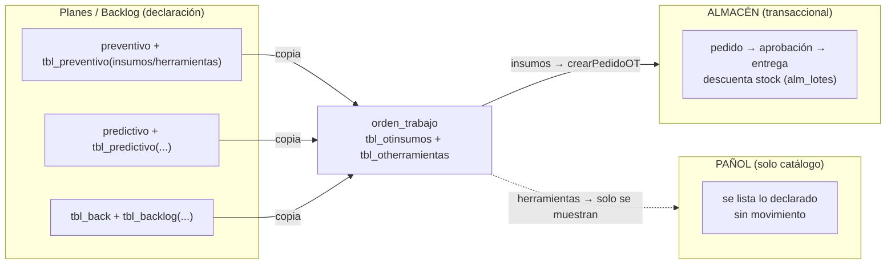
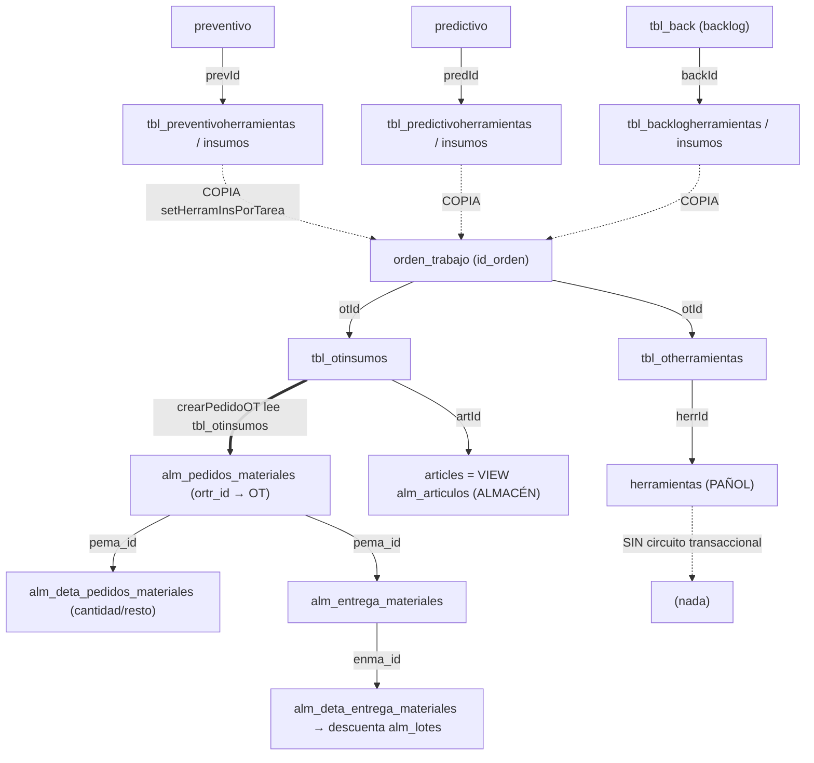
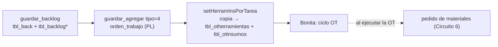
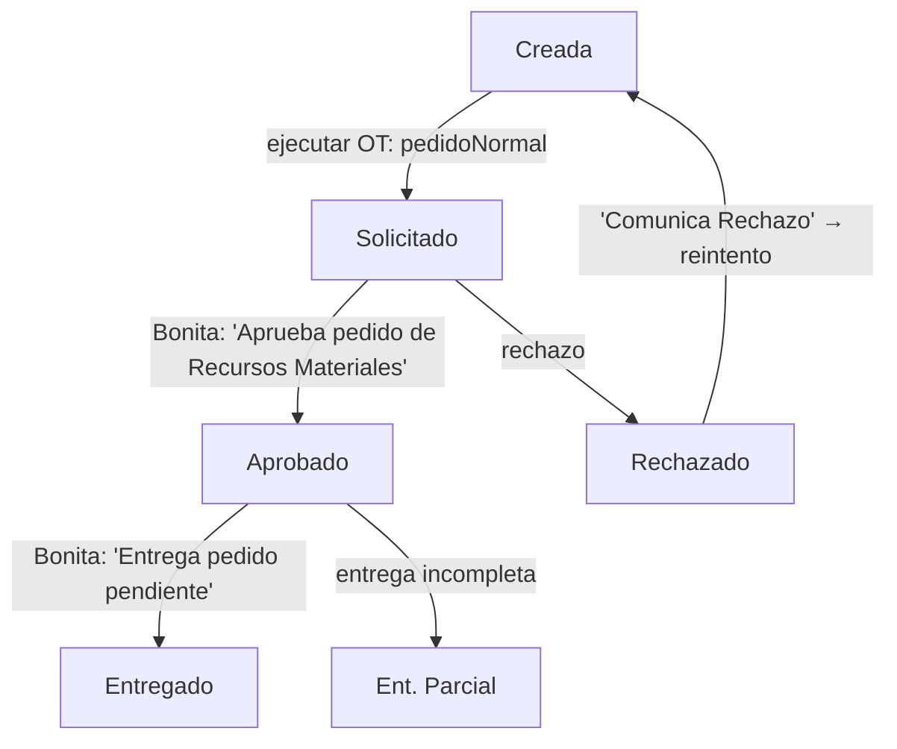
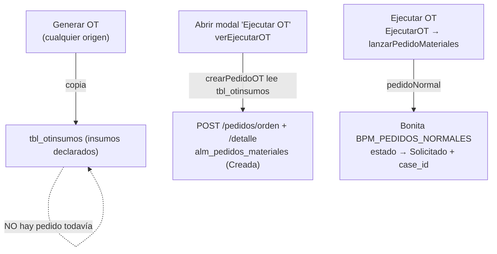

# Circuitos funcionales de Mantenimiento (MAN) y su relación con Almacenes (ALM) y Pañol (PAN)

## Objetivo

Explicar, siguiendo el código real de AssetPlanner, cómo funcionan los circuitos del módulo de mantenimiento (backlog, plan de mantenimiento, preventivo, predictivo, informe de servicio) y **exactamente dónde y cómo se enganchan con Almacenes (materiales/insumos) y Pañol (herramientas)**. Está escrito para el PM, para entender el espectro funcional antes de definir los casos de prueba de la migración a traz-tools. Cubre qué tabla se escribe en cada paso, qué dispara Bonita, y la asimetría estructural entre materiales y herramientas. **No cubre** la implementación de la migración en sí (eso está en `STATE.md` y en el plan de migración de traz-tools) ni los ABMs de catálogo.

> Todas las referencias son `archivo:línea` sobre la rama `develop-v3` (que ya incluye la migración de almacén/pañol a REST — F3/F4/F5). Donde el "cómo" cambió por la migración, se aclara; el "qué" funcional es el mismo que en producción v2.

---

## 1. Resumen ejecutivo — las tres ideas que hay que entender

**1. Hay un solo motor de generación de OT.** Backlog, preventivo, predictivo y correctivo generan su orden de trabajo por el **mismo** método: `Calendario::guardar_agregar()`. La única diferencia entre ellos es de qué tabla copia las herramientas e insumos. El "Plan de Mantenimiento" (el calendario) no es una pantalla más: es ese motor.

**2. El pedido de materiales nace de la OT, no del plan, y es perezoso (lazy).** Un preventivo o un backlog **no** generan un pedido de materiales cuando se crean ni cuando vencen. Solo declaran qué insumos harán falta. El pedido a almacén se crea **recién cuando alguien abre el modal de "Ejecutar OT"**, y se dispara a Bonita **recién cuando ejecuta la OT**.

**3. Materiales y herramientas son ASIMÉTRICOS — este es el punto central.**
- **Materiales (ALM):** circuito transaccional completo — pedido → aprobación → entrega (que descuenta stock real de un lote/depósito) → control de saldo (`resto`). Con estados y proceso Bonita propio.
- **Herramientas (PAN):** **solo se declaran y se listan.** No hay pedido de herramientas, no hay entrega, no hay devolución, no hay descuento de stock de pañol, no hay proceso Bonita. Una herramienta asociada a una OT es apenas una fila `(otId, herrId, cantidad)`.

Esta asimetría es la que más impacta la migración: la parte de ALM tiene mucho que probar (todo el ciclo de pedido/entrega), y la de PAN es casi solo lectura de catálogo.

---

## 2. Modelo de datos: cómo se conectan MAN, ALM y PAN

### 2.1 Las tablas puente (declaración de necesidades)

Cada artefacto de mantenimiento declara qué herramientas e insumos necesita, en tablas puente de forma idéntica: `id, <fk_artefacto>, herrId|artId, cantidad, id_empresa`.

| Artefacto | Herramientas (PAN) | Insumos (ALM) |
|---|---|---|
| Backlog (`tbl_back`) | `tbl_backlogherramientas` (`backId`) | `tbl_backloginsumos` (`backId`) |
| Preventivo (`preventivo`) | `tbl_preventivoherramientas` (`prevId`) | `tbl_preventivoinsumos` (`prevId`) |
| Predictivo (`predictivo`) | `tbl_predictivoherramientas` (`predId`) | `tbl_predictivoinsumos` (`predId`) |
| **Orden de trabajo** (`orden_trabajo`) | `tbl_otherramientas` (`otId`) | `tbl_otinsumos` (`otId`) |

`herrId` → catálogo `herramientas` (pañol). `artId` → catálogo `articles` (materiales).

### 2.2 Un dato clave: los catálogos de mantenimiento SON los del almacén

Verificado en la base (`information_schema`):
- **`articles` es una VIEW sobre `alm.alm_articulos`** — el "catálogo de insumos" de mantenimiento **es** el catálogo de artículos del almacén (`artId=arti_id`, `artBarCode=barcode`, etc.).
- **`abmdeposito` es una VIEW sobre `alm.alm_depositos`**.
- `herramientas` es tabla real (el pañol).

Esto explica por qué la migración de F3/F4 fue "cambiar de dónde se lee el catálogo": antes se leía la view local, ahora se lee el mismo dato en tools por REST.

### 2.3 Las tablas transaccionales de ALMACÉN (solo materiales)

| Tabla | Rol | Vínculo |
|---|---|---|
| `alm_pedidos_materiales` | Cabecera del pedido | **`ortr_id` → `orden_trabajo.id_orden`** (el puente MAN↔ALM), `estado`, `case_id` Bonita |
| `alm_deta_pedidos_materiales` | Detalle del pedido | `pema_id`, `arti_id`, `cantidad`, **`resto`** (saldo pendiente) |
| `alm_entrega_materiales` | Cabecera de entrega | `pema_id`, `solicitante`, `dni` |
| `alm_deta_entrega_materiales` | Detalle de entrega | `arti_id`, `cantidad`, **`lote_id`, `depo_id`, `precio`** (descuenta stock de ese lote) |
| `alm_recepcion_materiales` | Ingreso de mercadería | `prov_id` — **sin vínculo con OT** (reposición pura de almacén) |

**No existe ninguna tabla equivalente para herramientas** (`alm_pedidos_herramientas`, `alm_entrega_herramientas`… no existen — grep confirma cero resultados).

### 2.4 Tablas de pañol que sí tienen datos, pero fuera del circuito de OT

| Tabla | Qué es | Relación con MAN |
|---|---|---|
| `tbl_valesalida` / `tbl_detavalesalida` | Vale de salida de herramientas (18 vales en DEV, de 2020) | Lo escribe el **informe de servicio** (`Ordenservicios.php:230,240`) como registro **referencial** — guarda `herrId`, sin stock ni devolución. También lo usa el módulo Pañol standalone (`Orders.php`) |
| `asignaherramientas` (`id, herrId, id_orden, fechahora`) | Asignación de herramienta a una orden | **Tabla muerta** — 0 filas, sin ningún lector ni escritor en el código. Es el esqueleto de un circuito de préstamo que nunca se implementó |

### 2.5 Diagrama de relaciones

---

## 3. Los circuitos, uno por uno

### Circuito 1 — OT a partir de un BACKLOG

**Paso 1 — Declarar el backlog** (`Backlog::guardar_backlog`, `controllers/Backlog.php:335`):
- Inserta cabecera en `tbl_back` con `estado='C'` (`Backlog.php:368`).
- Si vienen herramientas → `insert_batch tbl_backlogherramientas` (`Backlog.php:393`). **(PAN, solo declaración)**
- Si vienen insumos → `insert_batch tbl_backloginsumos` (`Backlog.php:419`). **(ALM, solo declaración)**
- En este paso **no se toca stock ni Bonita**.

**Paso 2 — Generar la OT** (`Calendario::guardar_agregar`, tipo=4, `controllers/Calendario.php:277`):
- Cambia el backlog a estado `'PL'` (planificado) y cierra la tarea Bonita "Planificar Backlog".
- Inserta la OT (`orden_trabajo`, `estado='PL'`, `Calendario.php:344`).
- **Copia** herramientas e insumos del backlog a la OT: `setHerramInsPorTarea($idOT,'backlog',...)` (`Calendario.php:346`) → `insert tbl_otherramientas` (PAN) + `insert tbl_otinsumos` (ALM).
- Lanza el proceso Bonita del **ciclo de la OT** (`BPM_PROCESS_ID`, no el de pedidos).

**Paso 3 — El pedido de materiales (lazy)**: ver Circuito 6, común a todos.

### Circuito 2 — OT a partir del PLAN DE MANTENIMIENTO (preventivo/predictivo/correctivo)

Es el **mismo motor** que el backlog. El calendario (`Calendario::indexot`/`getTablas`) muestra los vencimientos; al programar una OT se llama a `guardar_agregar()`, que ramifica por `tipo`:

| tipo | Origen | Copia herramientas/insumos desde |
|---|---|---|
| 2 | Correctivo / Solicitud de servicio | **nada** (se cargan a mano en la OT) |
| 3 | Preventivo | `tbl_preventivoherramientas` / `tbl_preventivoinsumos` |
| 4 | Backlog | `tbl_backlogherramientas` / `tbl_backloginsumos` |
| 5 | Predictivo | `tbl_predictivoherramientas` / `tbl_predictivoinsumos` |

**Es idéntico al backlog en todo lo demás** (`setHerramInsPorTarea` → `tbl_ot*`, mismo Bonita de ciclo, mismo pedido lazy). Respondiendo tu pregunta 4 directamente: **sí, el plan de mantenimiento engancha con ALM y PAN exactamente igual que el backlog** — la única diferencia es la tabla de origen de la copia.

**Generación en serie** (preventivos/predictivos repetitivos, `setOTenSerie`): crea N OTs, y **copia herramientas e insumos a cada una** (N × `tbl_otherramientas` + N × `tbl_otinsumos`). Pero **no crea pedidos** en la generación: cada pedido surge después, individualmente, al ejecutar cada OT.

### Circuito 3 — PREVENTIVOS y PREDICTIVOS (respuesta a tu pregunta 5)

**¿Se generan pedidos?** No directamente. El preventivo/predictivo **declara** herramientas e insumos (`tbl_preventivo*` / `tbl_predictivo*`); cuando vence y se genera la OT, esos ítems se copian a la OT; y el pedido nace de la OT (Circuito 6). O sea: el pedido siempre nace de la OT, nunca del plan.

**¿Se muestra qué se usó de ALM y PAN?** Se muestra lo **declarado/planificado** (copiado a la OT), no un consumo transaccional:
- En la OT: `Otrabajos->getOTHerramientas()` / `getOTInsumos()` (leen `tbl_otherramientas`/`tbl_otinsumos`), usados en el detalle, reportes y PDFs de la OT.
- En reportería: `models/Reportes.php` hace `JOIN orden_trabajo → tbl_otherramientas → herramientas` con el comentario "herramientas que se usó" — pero es lo declarado, no un movimiento de pañol.
- Para insumos, además, existe el ciclo real de pedido/entrega (Circuitos 4 y 5) con `resto` y descuento de stock. Para herramientas, no hay equivalente.

**Predictivo por lectura de contador** (`Lectura.php`, `historial_lecturas`, `equipos.ultima_lectura`): **no tiene ninguna relación con ALM ni PAN.** Solo compara la lectura contra el umbral del plan y cambia el estado del preventivo (VE/CR/C) para disparar la OT. Es puro disparo, sin materiales ni herramientas.

### Circuito 4 — INFORME DE SERVICIO con consumo de materiales (respuesta a tu pregunta 2)

El informe de servicio registra lo que se hizo al ejecutar la OT. Se guarda con `Ordenservicio::setOrdenServ()` → `Ordenservicios::setOrdenServicios()` (`models/Ordenservicios.php:216`), que escribe (todo en MariaDB de asset):
- `orden_servicio` (cabecera, `estado='C'`), `deta_ordenservicio` (tareas realizadas), `asignausuario` (operarios).
- **`tbl_valesalida` + `tbl_detavalesalida`** — el "vale de salida" de las herramientas usadas (referencial, guarda `herrId`).

**Hallazgo funcional importante:** el informe **no persiste los materiales consumidos**. Hay un TODO en el código que lo admite textualmente (`Ordenservicio.php:207-208`: *"BORRAR INSUMOS!! ver donde mierda guarda"*). Lo que el informe muestra como **"Insumos Usados"** es en realidad **lo PEDIDO** (`getInsumosPorOT` lee la `cantidad` de `alm_deta_pedidos_materiales` vía REST), no lo entregado ni lo consumido realmente.

O sea: **el informe mezcla los tres conceptos** (pedido / entregado / consumido) y muestra el pedido con la etiqueta "usado". La distinción real (pedido vs entregado vs saldo) existe, pero vive en el circuito de entrega de almacén, no en el informe (ver Circuito 5).

### Circuito 5 — APROBACIÓN de pedidos y visualización de lo usado (respuesta a tu pregunta 3)

La aprobación y entrega de los materiales pedidos es un flujo **de almacén, orquestado por Bonita**, en `controllers/traz-comp-almacen/Proceso.php`:

- **Aprobar** (`Proceso.php:118`): setea estado `Aprobado`/`Rechazado`. Solo cambia estado.
- **Entregar** (`Proceso.php:126-132`): es el **único punto que toca stock real** — `insert_entrega_materiales` (`Ordeninsumos.php:119`) inserta `alm_entrega_materiales`/`alm_deta_entrega_materiales`, hace `UPDATE alm_lotes SET cantidad = cantidad - X` (descuento de stock por lote/depósito) y actualiza el `resto` del pedido. Luego setea `Entregado`/`Ent. Parcial`.
- La pantalla de entrega es la única que muestra las **tres cantidades**: pedida / entregada / disponible en stock (`view_entrega_pedido_pendiente.php`).

**Aprobación del INFORME** (distinta de la del pedido): es 100% Bonita, sobre el proceso principal de mantenimiento — tareas "Verifica Informe de Servicio" (`Tarea::verificarInforme`) y "Presta conformidad" (`Tarea::prestarConformidad`), cerradas con un booleano. Al aprobar, la OT pasa a `CE`→`CN`. **No toca ALM ni PAN.**

**Qué se ve del consumo en el informe aprobado:**
- **Materiales (ALM):** se ve lo **pedido** (rotulado "Insumos Usados"), no lo entregado ni el saldo. Los valores reales de entrega/stock solo se ven en la pantalla de entrega de almacén.
- **Herramientas (PAN):** se ven las herramientas **asociadas** vía el vale de salida (`getHerramOrdenes` → `view_presta_presta_conf_modal.php`), enriquecidas con nombre/marca del pañol de tools (solo lectura). Sin estado de uso/devolución, porque no existe transacción de pañol.

### Circuito 6 — El pedido de materiales (común a todos los circuitos)

Este es el corazón de la relación MAN↔ALM, y es el mismo sin importar si la OT vino de backlog, preventivo, predictivo o correctivo:

1. **Al generar la OT** solo se escribe `tbl_otinsumos`. No hay pedido.
2. **Al abrir el modal de ejecución** (`verEjecutarOT`): `crearPedidoOT()` lee `tbl_otinsumos` y crea la cabecera + detalle del pedido en estado `Creada`. **Solo insumos — las herramientas no participan.**
3. **Al ejecutar la OT**: el JS llama `pedidoNormal()`, que lanza el proceso Bonita de pedidos y deja el pedido `Solicitado` con su `case_id`.

> **Dónde tocó la migración (F3/F4/F5):** el paso 2/3 antes escribía las tablas `alm_*` locales de MariaDB; ahora `Pedidos_Materiales` las opera por REST contra el almacén de tools (PostgreSQL). El proceso Bonita es el mismo. Los catálogos (`getinsumo`, `getHerramientasB`) antes leían las views locales; ahora leen tools por REST. El comportamiento funcional es idéntico.

---

## 4. Otros enganches con ALM/PAN que conviene tener en el radar

- **Pedido manual durante la ejecución** (`Notapedido::setNotaPedido`): además del pedido automático desde `tbl_otinsumos`, en el modal de ejecución se pueden agregar materiales a mano — también crea `alm_pedidos_materiales` (estado `Creada`).
- **Pedido extraordinario** (`BPM_PROCESS_ID_PEDIDOS_EXTRAORDINARIOS`, `Pedidoextra`): rama de aprobación por Compras, distinta del pedido normal.
- **Recepción de materiales** (`alm_recepcion_materiales`): reposición de stock del almacén, sin vínculo con OT — es almacén puro, no mantenimiento.
- **Módulo Pañol standalone** (menú "Salida/Entrada Herramientas", `Order.php`/`Unload.php`): tiene su propio circuito de vales (`tbl_valesalida`), **independiente del circuito de OT**. Es el pañol como módulo aparte, no el enganche con mantenimiento.

---

## 5. Cobertura funcional — repaso de que cubrimos todo

| # | Circuito que pediste | Cubierto | Circuito(s) de este doc |
|---|---|---|---|
| 1 | OT desde backlog, con pedido a ALM y herramientas | ✅ | Circuito 1 + 6 |
| 2 | Informe de servicio con consumo de materiales (ALM) | ✅ | Circuito 4 |
| 3 | Aprobación de informes + visualización de materiales/herramientas | ✅ | Circuito 5 |
| 4 | OT desde Plan de Mantenimiento (¿igual que backlog?) | ✅ (sí, igual) | Circuito 2 + 6 |
| 5 | Preventivos/predictivos: ¿pedidos? ¿se muestra lo usado? | ✅ | Circuito 3 |

Enganches adicionales que releví por las dudas: pedido manual, pedido extraordinario, recepción, pañol standalone, predictivo por contador (§3-§4). Con esto queda cubierto todo el espectro donde MAN toca ALM y PAN.

---

## 6. Qué significa esto para los casos de prueba de la migración

La asimetría define dónde está el riesgo y, por lo tanto, dónde concentrar las pruebas:

**ALM (materiales) — mucho que probar, es transaccional:**
1. Declarar insumos en un backlog / preventivo / predictivo → verificar que el catálogo viene de tools (F3).
2. Generar la OT → verificar que los insumos se copian a `tbl_otinsumos`.
3. Abrir "Ejecutar OT" → verificar que se crea el pedido en tools (F5) leyendo `tbl_otinsumos`.
4. Ejecutar la OT → verificar que se dispara Bonita y el pedido pasa a `Solicitado`.
5. Aprobar y **entregar** → verificar el descuento de stock (`alm_lotes`) y el `resto` — **este es el paso más delicado y el que menos se probó**.
6. Ver el informe → verificar que muestra los materiales (recordando que muestra lo pedido, no lo consumido).
7. Casos negativos: pedido de empresa A no visible para empresa B (aislamiento); OT sin insumos declarados (no crea pedido); entrega parcial (`Ent. Parcial` + `resto`).

**PAN (herramientas) — poco que probar, es solo catálogo:**
1. Declarar herramientas en un plan → verificar que el catálogo (con marca resuelta) viene del pañol de tools (F4).
2. Generar la OT → verificar que se copian a `tbl_otherramientas`.
3. Ver la OT / el informe → verificar que se listan con nombre y marca correctos.
4. No hay circuito de pedido/entrega/devolución de herramientas que probar — **si aparece uno, es un requisito nuevo, no una regresión.**

**Decisión funcional que conviene tomar** (no la resuelve este documento): el informe muestra lo **pedido** como "usado". Si el negocio necesita reflejar el **consumo real** (lo entregado, o lo efectivamente gastado), eso **no existe hoy** en asset (el TODO del código lo confirma) y sería una mejora funcional, no parte de la migración.

---

## Anexo — Máquina de estados del pedido de materiales

| Estado | Significado | Quién lo setea |
|---|---|---|
| `Creada` | Cabecera+detalle creados, sin lanzar | `crearPedidoOT` / `setNotaPedido` |
| `Solicitado` | Lanzado a Bonita, esperando aprobación | `pedidoNormal` → `setCaseId` |
| `Aprobado` | Aprobado, listo para entregar | Bonita "Aprueba pedido de Recursos Materiales" |
| `Rechazado` | Rechazado (con motivo) | ídem, rama rechazo |
| `Entregado` | Entregado completo (descontó stock) | Bonita "Entrega pedido pendiente" |
| `Ent. Parcial` | Entregado parcialmente (queda `resto`) | ídem, entrega incompleta |

Conteo real en DEV (2026-08): Solicitado 40, Entregado 29, Creada 14, Ent. Parcial 12, Aprobado 11, Rechazado 1 — la máquina de estados está viva y con todos los estados usados.
