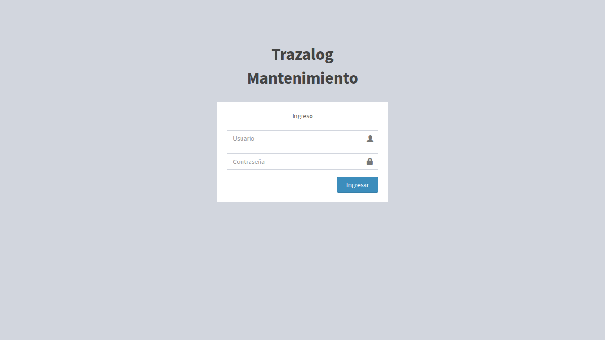
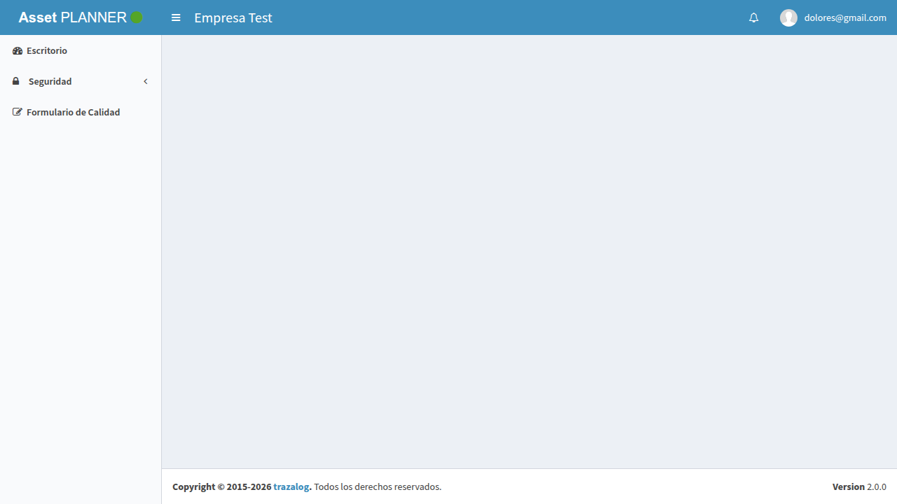
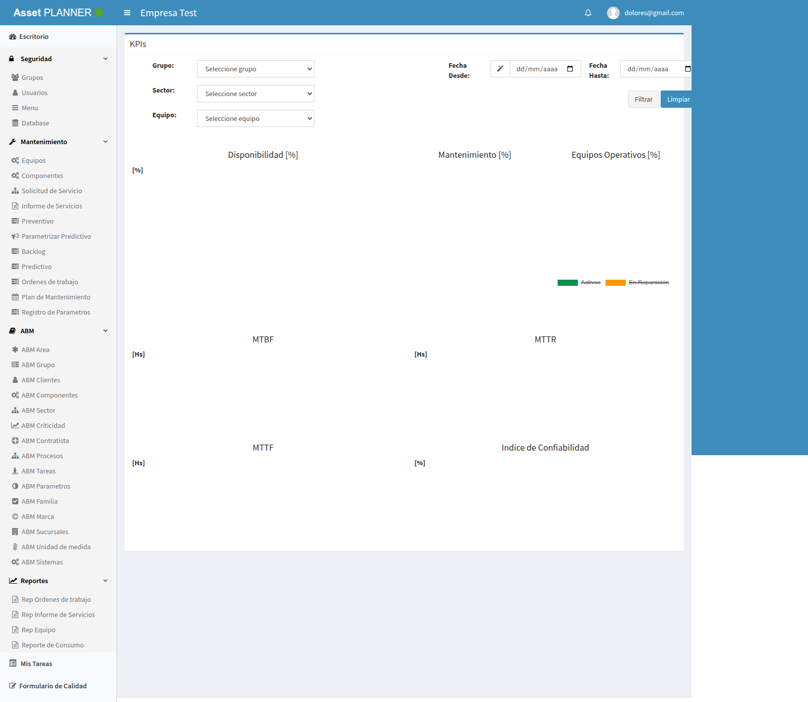
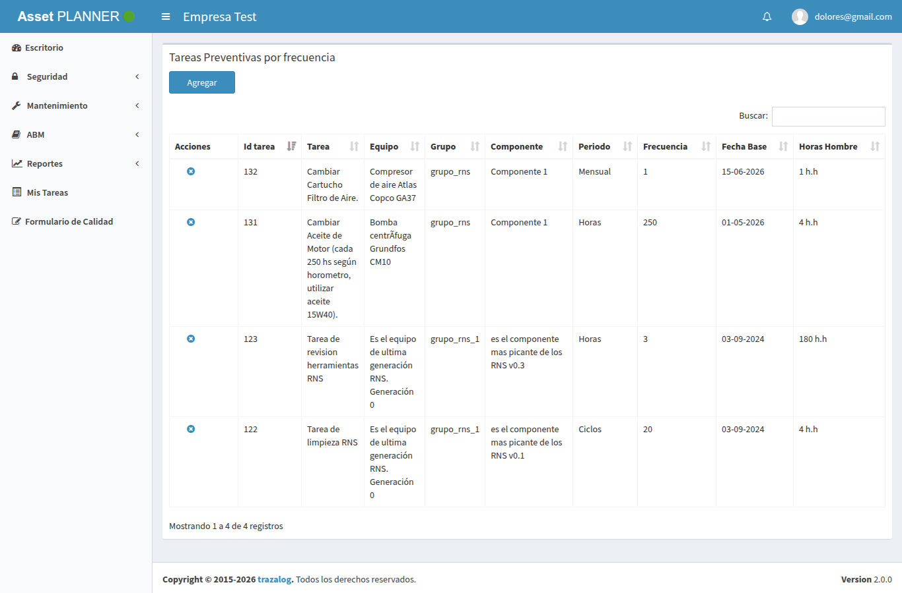
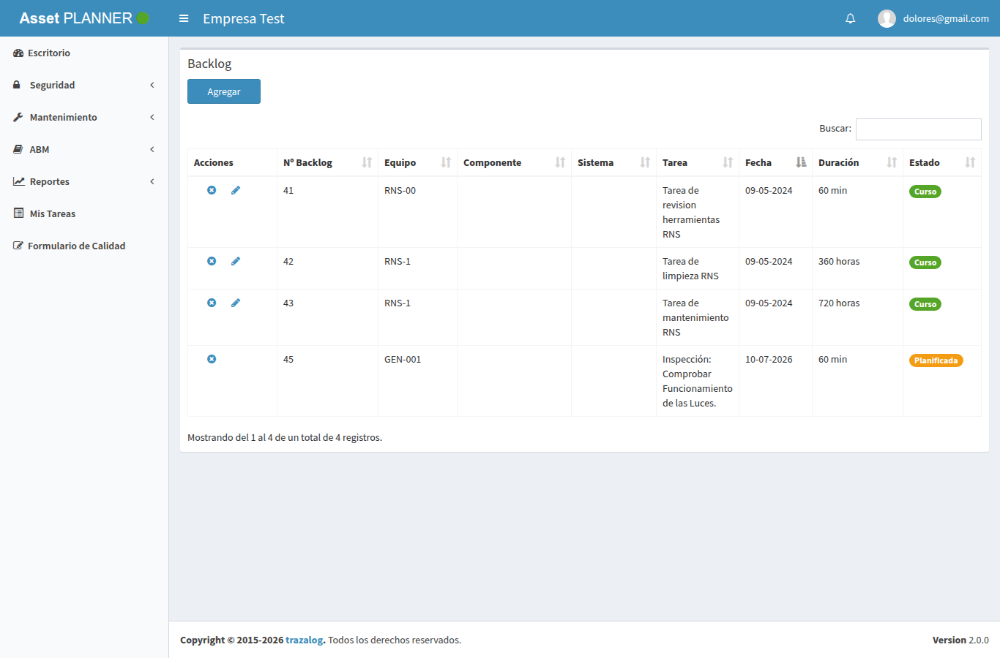
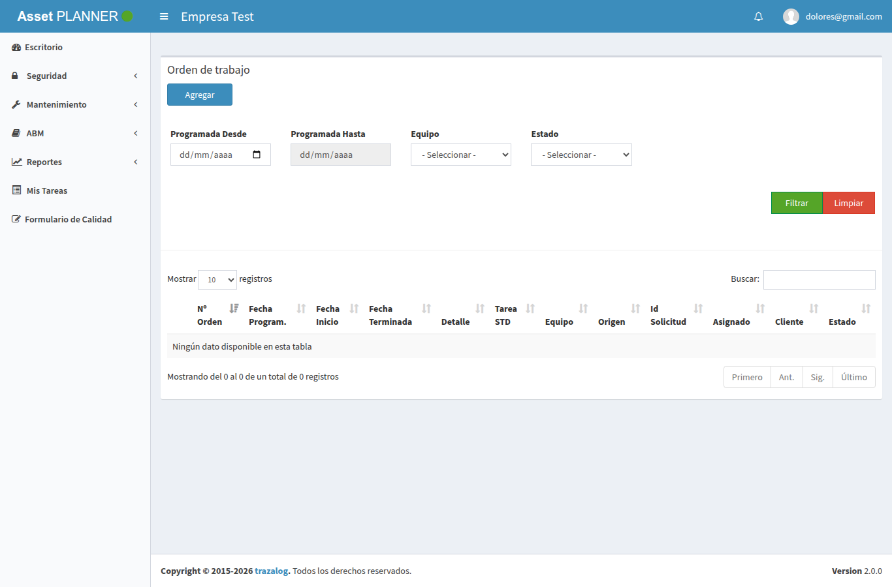
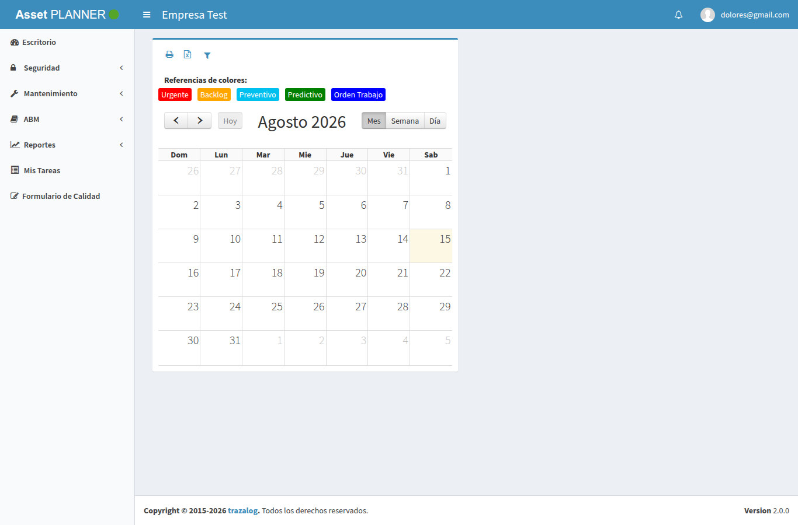
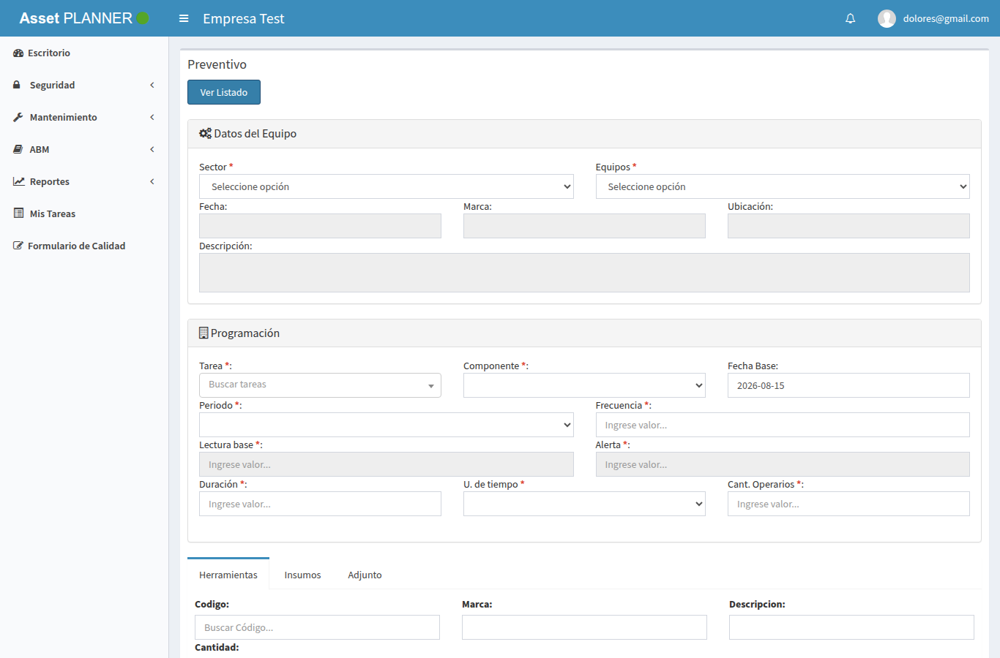

# Resultados de la prueba en pantalla — REQ-ASSET-ALM (fase F6)

## Objetivo

Registrar la ejecución real, sobre las pantallas de AssetPlanner, de las pruebas del requerimiento "asset consume el almacén y el pañol de traz-tools" (fases F3-F5). Documenta el entorno, las credenciales usadas, cada caso de prueba con su resultado y captura, y los hallazgos. Es el respaldo de que el requerimiento funciona end-to-end antes del piloto. **No sustituye** la suite automatizada de `tests/e2e/` (que quedó escrita para re-correr esto en cualquier momento); este documento es la corrida manual asistida del 2026-08-15.

---

## 1. Entorno de la prueba

| Ítem | Valor |
|---|---|
| Fecha | 2026-08-15 |
| App | AssetPlanner, rama `develop-v3` + los fixes F4/F5 (#329, #330) |
| Servidor | PHP 7.3.25 (XAMPP `/opt/lampp`) sirviendo el repo en `http://127.0.0.1:8899` |
| Base de datos | MariaDB `assetv2` en `10.142.0.13:3306` (DEV, vía VPN) |
| WSO2 (DataServices) | EI en `http://10.142.0.13:8280` — `ALMDataService`, `PANDataService`, `COREDataService` |
| Bonita | `http://10.142.0.13:8080/bonita` (compartido con tools) |
| Empresa de prueba | **Empresa Test** — `id_empresa=1` en assetv2 ↔ `empr_id=1` en tools |
| Config del cliente | `DEPO=2000`, `PANO=10`, `ESTA=6` en `core.tablas` (setup F2) |

### Credenciales usadas

| Campo | Valor |
|---|---|
| Usuario | `dolores@gmail.com` |
| Contraseña | `12345` |

> Cómo se obtuvo la contraseña: es el único usuario de la empresa de prueba (empr 1). La columna `sisusers.usrPassword` guarda el hash **MD5** de la contraseña — el valor `827ccb0eea8a706c4c34a16891f84e7b` corresponde a `12345` (MD5 sin salt, trivial de revertir; a registrar como deuda de seguridad de la app, ajena a este requerimiento).

> Ajuste temporal para la prueba: el usuario `dolores` pertenecía al grupo `23` ("grupo prueba", 3 permisos), que no da acceso al módulo de Mantenimiento. Para poder navegar todas las pantallas se le asignó **temporalmente** el grupo `1` (Administrador, 198 permisos) con un `UPDATE usuarioasempresa`, y **se restauró a `23` al terminar** la prueba. Es un cambio reversible en DEV, no en producción.

---

## 2. Resumen de resultados

| # | Caso | Fase | Resultado |
|---|---|---|---|
| 1 | Login e ingreso al sistema | — | ✅ |
| 2 | Menú sin almacén ni pañol | F3/F4 | ✅ |
| 3 | Catálogo de artículos desde tools | F3 | ✅ |
| 4 | Catálogo de herramientas desde el pañol de tools | F4 | ✅ |
| 5 | Pantallas de planes y OTs cargan con datos | F3/F4 | ✅ |
| 6 | Insumos de la OT desde los pedidos de tools | F5 | ✅ |
| 7 | Alta de pedido desde la OT con Bonita | F5 | ✅ (verificado por API, ver §3.6) |

> **Nota de corrección (2026-08-15, revisión posterior):** una primera versión de este documento reportó dos hallazgos —login y autocompletes "rotos por deuda de jQuery"— que resultaron **falsos**. Eran un artefacto del servidor de prueba (se sirvió la app con `index.php` explícito en la URL, sin `mod_rewrite`, lo que rompía las URLs relativas del JavaScript con un doble `index.php`). Al servir con URLs limpias —como el Apache real— el login por navegador funciona y jQuery UI carga correctamente. Ver §4.1. **El requerimiento no introduce ningún problema de login ni de operación.**

---

## 3. Casos de prueba

### 3.1 Login e ingreso

Se abre `/login`, se ingresan las credenciales y se entra al escritorio (KPIs). El envío del formulario dispara el POST AJAX a `login/sessionStart_` y redirige a `/dash`.





**Resultado:** ✅ Se ingresa al sistema desde el navegador, con la empresa "Empresa Test" y el usuario `dolores@gmail.com` en la barra superior. (En la primera corrida el login por navegador pareció fallar; se comprobó que era un artefacto del servidor de prueba, no de la app — ver §4.1.)

### 3.2 El menú ya no ofrece almacén ni pañol (F3/F4)

Con permisos de administrador, el menú lateral muestra Mantenimiento, ABM y Reportes completos — y **ninguna** opción de almacén ni de pañol.



**Presentes (correcto):** Escritorio, Seguridad, Mantenimiento (Equipos, Componentes, Solicitud de Servicio, Informe de Servicios, Preventivo, Parametrizar Predictivo, Backlog, Predictivo, Órdenes de trabajo, Plan de Mantenimiento, Registro de Parámetros), ABM (14 ítems), Reportes, Mis Tareas.

**Ausentes (correcto — inhabilitados por F3/F4):** Almacenes y todos sus hijos (Artículos, Stock, Entrega/Recepción de Materiales, Punto Pedido, Pedidos Materiales, Ajuste Stock, Recep./Salida Depósito), Compras, Administrar Órdenes, ABM Depósito, ABM Proveedor, ABM Plantilla Insumos, y el grupo Pañol completo (Herramientas, Salida/Entrada Herramientas, Trazabilidad Componentes).

**Resultado:** ✅ El sidebar real no expone ninguna función de almacén ni pañol. Se verificó además que el guard de padre agregado en `Groups::mnuAll()` oculta correctamente a los hijos que quedaron en estado `AC` cuyo padre ("Almacenes") está inhabilitado — sin ese guard, seis ítems habrían reaparecido (ver §4.3).

### 3.3 Catálogo de artículos desde tools (F3)

Se invocan los endpoints que alimentan los autocompletes de insumos (los mismos que usan las pantallas de planes):

| Endpoint | Resultado |
|---|---|
| `Preventivo/getinsumo` | HTTP 200 — **311 artículos**. Ejemplo: `{value:82, codigo:"MP0001", label:"Ajo semilla - VARIEDAD: Blanco Valenciano"}` |
| `Preventivo/traerinsumo` (id 82) | HTTP 200 — devuelve `artBarCode:"MP0001"`, `artDescription:"Ajo semilla..."` |

**Resultado:** ✅ El catálogo viene del `ALMDataService` de tools (la tabla local `articles` de asset no se consulta). El artículo `MP0001` no existe en asset — es dato de tools.

### 3.4 Catálogo de herramientas desde el pañol de tools (F4)

| Endpoint | Resultado |
|---|---|
| `Preventivo/getHerramientasB` | HTTP 200 — **26 herramientas**. Ejemplo: `{value:17, codigo:"123456", marca:"Bahco", label:"herramienta de prueba 123456"}` |
| `Preventivo/getherramienta` | HTTP 200 — 26 filas con el shape viejo (`herrId`, `herrcodigo`, `herrmarca`, `herrdescrip`, …) |

**Resultado:** ✅ El catálogo viene del `PANDataService` de tools. La **marca** ("Bahco") llega resuelta desde `core.tablas` — en asset era un texto libre. La 27ª herramienta de la empresa está borrada lógicamente (`eliminado=true`) y el DataService la excluye correctamente.

### 3.5 Pantallas de planes y OTs cargan con datos (F3/F4)

Se abren las pantallas del módulo y se verifica que rendericen su contenido.









El formulario de alta de un preventivo muestra las pestañas **Herramientas** e **Insumos** — los campos que F3/F4 alimentan desde tools:



**Resultado:** ✅ Las cuatro pantallas cargan y muestran sus tablas con datos. El formulario abre con las pestañas de Herramientas e Insumos, cuyos campos de búsqueda son los autocompletes que consumen el catálogo de tools (§4.2).

### 3.6 Circuito de pedido desde la OT con Bonita (F5)

El lector `Ordenservicio/getInsumosPorOT` (OT 935) devuelve, desde los pedidos de tools:

```json
{ "pema_id":"1486", "ortr_id":"935", "barcode":"7897046705111",
  "descripcion":"VDE2 230  440469_edit", "estado":"Solicitado", "cantidad":"13" }
```

El alta completa del pedido se verificó de punta a punta contra los DataServices y Bonita reales (réplica exacta de lo que hace `crearPedidoOT()` + `pedidoNormal()` del código):

| Paso | Resultado |
|---|---|
| Crear cabecera del pedido para la OT 935 | pedido **1486** en el Postgres de tools |
| Insertar el detalle (art. 402 ×13) | `resto=13` puesto por el trigger `tgrupdateresto`, nombre y barcode resueltos por el DS |
| Lanzar el proceso Bonita (`8803...315`, compartido con tools) | instancia **case 30010** |
| Persistir `case_id` + estado | pedido queda `Solicitado` con `case_id=30010`, releído OK |

**Resultado:** ✅ El flujo ejecutar-OT crea el pedido en el almacén de tools y lanza el proceso Bonita compartido. (Este caso escribe datos reales; se corrió contra DEV a propósito.)

---

## 4. Hallazgos

### 4.1 Falso positivo de la primera corrida: el login y el JavaScript sí funcionan

La primera versión de este documento reportó que el login por navegador fallaba con `Cannot read properties of undefined (reading 'regional')` y lo atribuyó a la deuda de jQuery del fork. **Ese diagnóstico era incorrecto.**

La causa real era el **servidor de prueba**: se sirvió la app con `index.php` explícito en la URL (`/index.php/login`), sin `mod_rewrite`. Con esa forma, las URLs relativas del JavaScript (`url: 'index.php/login/sessionStart_'`) se resolvían con un **doble `index.php`** (`/index.php/index.php/login/sessionStart_`) y daban 404 — el click sí disparaba el AJAX, pero contra una URL inexistente.

Al servir con **URLs limpias** (como el Apache real del proyecto, con `.htaccess`/`mod_rewrite`):

- El login por navegador **funciona**: enviar el formulario redirige a `/dash`.
- jQuery UI está cargado y operativo (verificado en runtime: `jQuery.ui.autocomplete` y `jQuery.datepicker` definidos, el handler del botón registrado).
- El error `regional` sigue apareciendo como advertencia de consola (init de un locale de datepicker), pero **no es bloqueante**: no impide el login ni la carga de los widgets.

**Conclusión:** no hay ningún problema de login ni de operación introducido por este requerimiento, ni un bloqueante de jQuery en este flujo. El error de la primera corrida era del entorno de prueba, no de la app.

### 4.2 Autocompletes: widget y datos correctos; despliegue visual no capturado en el entorno de prueba

Los campos de búsqueda de insumo (`#insumo`) y herramienta (`#herramienta`) del formulario de preventivo son autocompletes de jQuery UI cuyo `source` apunta a `Preventivo/getinsumo` y `Preventivo/getHerramientasB` — los endpoints que §3.3 y §3.4 verificaron devolviendo el catálogo de tools (311 artículos, 26 herramientas). El widget `.autocomplete()` existe y está registrado; los datos que consumiría están confirmados.

No se logró **capturar la lista de sugerencias desplegándose visualmente**: el servidor de prueba usado (el servidor embebido de PHP, single-thread) es demasiado lento para que el formulario y sus llamadas AJAX terminen de cargar dentro de los tiempos del test automatizado. **Es una limitación del entorno de prueba, no un fallo detectado en la app.** Queda como verificación visual pendiente de confirmar en la instancia normal del proyecto (Apache), donde el resto del flujo ya funciona.

### 4.3 Seis ítems de menú de almacén dependen solo del guard de padre

Los scripts `f3-inhabilitar-menu-almacen.sql` inhabilitaron el grupo "Almacenes" y algunos hijos, pero seis hijos (Artículos, Stock, Entrega/Recepción de Materiales, Punto Pedido, Pedidos Materiales) quedaron en estado `AC`. Hoy **no se ven** porque el guard de padre de `Groups::mnuAll()` (F3) oculta a los hijos de un padre inhabilitado — verificado en pantalla. Pero es más robusto inhabilitarlos también explícitamente: si alguien reactivara "Almacenes" sin más, reaparecerían. Es una mejora menor del script de F3, sin urgencia (la app oculta bien hoy).

### 4.4 Deuda de seguridad: contraseñas en MD5 sin salt

`sisusers.usrPassword` guarda MD5 plano de la contraseña — reversible con un diccionario para claves débiles (como se hizo acá con `12345`). Es de la app legacy, ajeno a este requerimiento; se anota para el plan de migración.

---

## 5. Conclusión

El objetivo funcional de REQ-ASSET-ALM está **verificado en el sistema real**: AssetPlanner ya no ofrece almacén ni pañol propios en el menú, sus catálogos de artículos (311) y herramientas (26) vienen de los DataServices de traz-tools con los datos correctos, el login por navegador funciona, y el flujo de pedido desde una OT crea el pedido en el almacén de tools y lanza el proceso Bonita compartido (pedido 1486, case 30010).

Los dos "hallazgos" de la primera corrida (login y autocompletes) resultaron **falsos positivos del entorno de prueba** (§4.1/§4.2): un servidor sin `mod_rewrite` que rompía las URLs relativas del JavaScript. Con URLs limpias —como el Apache normal del proyecto— no se reproducen. Queda una sola verificación menor pendiente de hacer en la instancia normal: **ver la lista de sugerencias del autocomplete desplegándose en pantalla** (el widget y sus datos ya están confirmados; solo faltó capturarlo por la lentitud del servidor de prueba).

---

## Anexo — Cómo se reprodujo

La suite automatizada equivalente está en [`tests/e2e/`](../../tests/e2e/README.md) (Playwright). La corrida de este documento se hizo con:

```bash
# servidor de la app (PHP 7.3 de XAMPP + router de CI que emula mod_rewrite,
# sirviendo URLs limpias como el Apache normal — sin esto, las URLs relativas
# del JS se rompen; ver §4.1)
/opt/lampp/bin/php -S 127.0.0.1:8866 ci-router.php   # docroot = repo de asset

# login por navegador, sesión reutilizada, verificación de endpoints y
# capturas de pantalla con el Chrome del sistema vía Playwright
```

Los valores de prueba (empresa 1, artículo 82/MP0001, herramienta 17/Bahco, OT 935) son los de DEV verificados el 2026-08-15.
