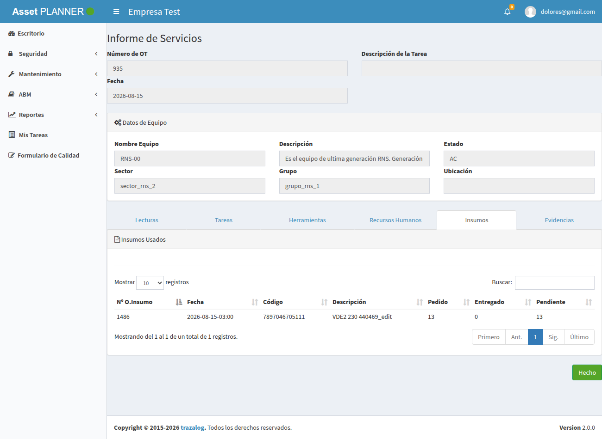
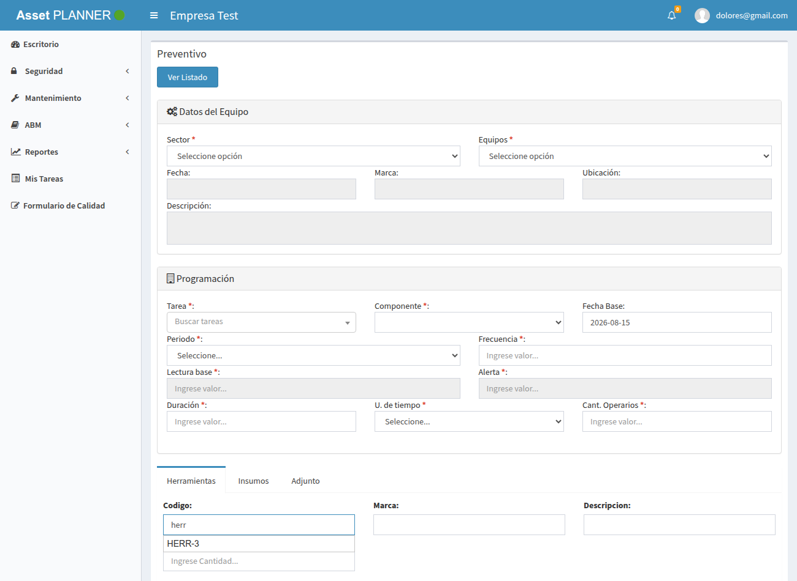

# Resultados de la corrida de regresión — mejoras M1/M2 del circuito MAN↔ALM/PAN

## Objetivo

Registrar la ejecución real de la suite de regresión Playwright (`tests/e2e/`) sobre las mejoras M1 (consumo real en el informe) y M2 (herramientas disponibles del pañol + vale), con el detalle de cada caso y capturas de pantalla de la app. Es el respaldo de que las mejoras funcionan end-to-end antes de mergearlas. **No sustituye** el catálogo de casos ([`casos-prueba-man.md`](casos-prueba-man.md)) ni el detalle de los circuitos ([`circuitos-man-alm-pan.md`](circuitos-man-alm-pan.md)); es la corrida del 2026-08-15.

---

## 1. Entorno

| Ítem | Valor |
|---|---|
| Fecha | 2026-08-15 |
| App | AssetPlanner, rama de las mejoras (M1 + M2 + fix `PANDataService`) |
| Servidor | PHP 7.3.25 (XAMPP) sirviendo el repo, URLs limpias (emula `mod_rewrite`) |
| Base de datos | MariaDB `assetv2` en `10.142.0.13:3306` (DEV, vía VPN) |
| WSO2 (DataServices) | EI en `10.142.0.13:8280` — `ALMDataService`, `PANDataService`, `COREDataService` |
| Empresa de prueba | `id_empresa=1` (assetv2) ↔ `empr_id=1` (tools); depósito 2000, pañol 10 |
| Usuario / clave | `dolores@gmail.com` / `12345` |
| Herramienta de la captura | `herr_id=66` (HERR-3, Stanley), pañol 10, estado ACTIVO |

---

## 2. Resultado de la suite (Playwright)

```
05-informe-consumo.spec.js
  ✓ CP-30: getInsumosPorOT devuelve pedido / entregado / pendiente
  ✓ CP-31: la vista de conformidad del informe muestra las columnas de consumo
06-herramientas-panol.spec.js
  ✓ CP-50/51: el autocomplete de planes solo trae disponibles del pañol, ordenadas
  ✓ CP-52: el catálogo del INFORME también filtra disponibles del pañol
  - CP-53/54 (@escribe): skipped (test de escritura, opt-in)

4 passed / 0 failed / 1 skipped
```

Ejecutado con `npx playwright test 05-informe-consumo.spec.js 06-herramientas-panol.spec.js --workers=1` contra la app real.

---

## 3. M1 — Consumo real en el informe

**Caso CP-30/CP-31.** Se abrió el informe de servicio de la OT 935 (que tiene el pedido de materiales 1486) y se verificó la pestaña **Insumos**.



**Qué se ve:** la tabla "Insumos Usados" ahora tiene las columnas **Pedido / Entregado / Pendiente**. Para el pedido 1486 (artículo `VDE2 230 440469_edit`, código `7897046705111`): **Pedido 13, Entregado 0, Pendiente 13** — coherente con un pedido `Solicitado` que todavía no se entregó (`entregado = cantidad − resto = 13 − 13 = 0`).

**Verificación del cálculo (CP-30):** el test comprueba que cada fila trae los tres campos y que se cumple la identidad `pedido = entregado + pendiente`. Con un pedido entregado (por ejemplo el pedido 958 de DEV, cantidad 15 / resto 0) el entregado daría 15 — la misma fórmula.

---

## 4. M2 — Herramientas disponibles del pañol

**Caso CP-50/51/52.** Se abrió el formulario de un preventivo, pestaña **Herramientas**, y se disparó el autocomplete.



**Qué se ve:** al escribir en el buscador de herramientas, el autocomplete ofrece **HERR-3** — una herramienta disponible (`ACTIVO`) del pañol asignado (10).

**Verificación del filtro (CP-50/51/52), por endpoint:** el test comprueba, sobre el catálogo completo que devuelve el sistema, que:
- La herramienta disponible del pañol asignado (herr 66) **sí** está.
- La herramienta en `TRANSITO` (herr 22, prestada del mismo pañol) **no** está.
- La herramienta `ACTIVO` pero de **otro pañol** (herr 17, pañol 3) **no** está.
- Las herramientas vienen **ordenadas por nombre**.

Confirmado en la corrida: `Preventivo/getHerramientasB` devolvió las **7** disponibles del pañol 10, excluyendo la 22 (TRANSITO) y la 17 (otro pañol). El catálogo del informe (`ordenservicio/getHerramienta`) aplica el mismo filtro con el shape que su autocomplete espera.

**El vale de salida (CP-53/54)** — que al guardar el informe crea la salida contra `PANDataservice` y deja la herramienta en `TRANSITO` — se validó **por API** end-to-end en el desarrollo de M2 (crear salida → detalle → `PUT estado=TRANSITO`, verificado en la base y restaurado). Como test automatizado queda marcado `@escribe` (opt-in con `E2E_ESCRITURA=1`) por crear datos reales.

---

## 5. Conclusión

Las dos mejoras funcionan sobre la app real: el informe muestra el consumo real (pedido/entregado/pendiente) y las listas de herramientas ofrecen solo las disponibles del pañol asignado. La suite de regresión (`05` y `06`) queda en verde y lista para incorporarse al CI/CD (ver [`../../tests/e2e/README.md`](../../tests/e2e/README.md)).

> Nota sobre el entorno de captura: el informe de M1 se cargó dentro del dashboard (como en producción) para que el AJAX que puebla la tabla resuelva bien; servido como página suelta, las URLs relativas del JS se rompen — es un artefacto del servidor de pruebas, no de la app.
